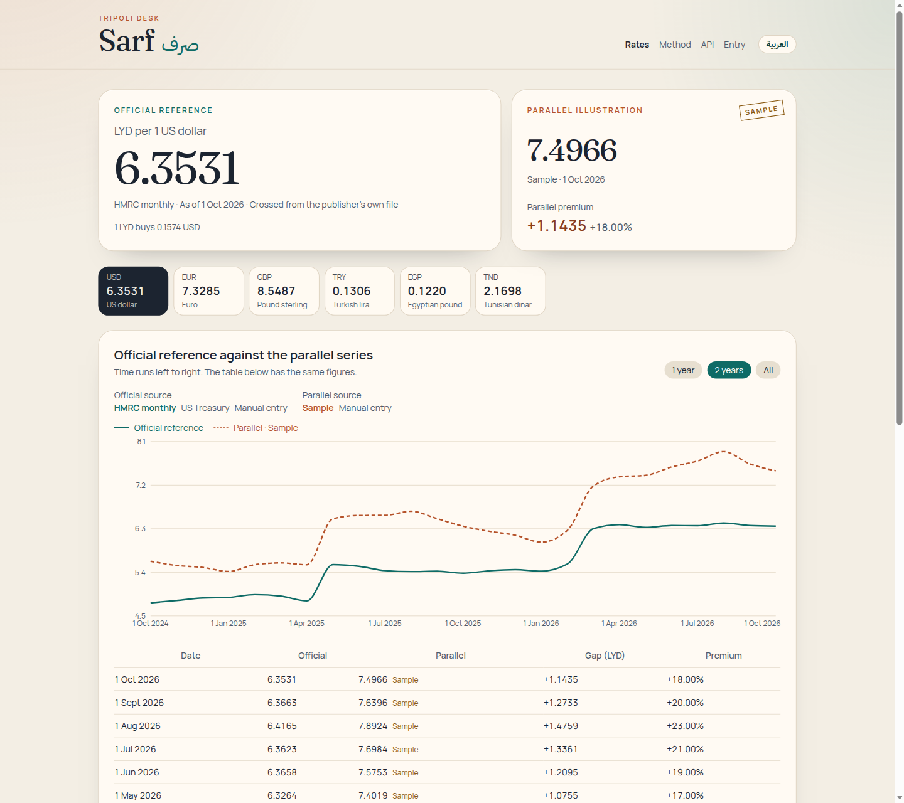
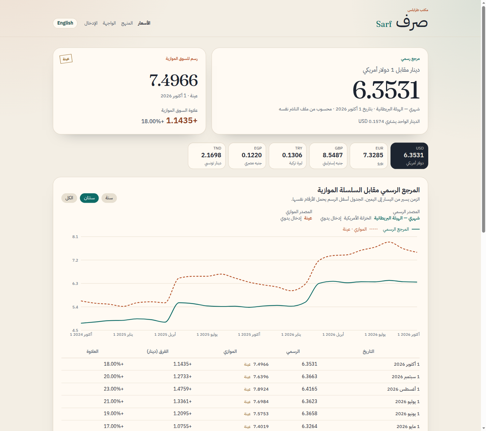
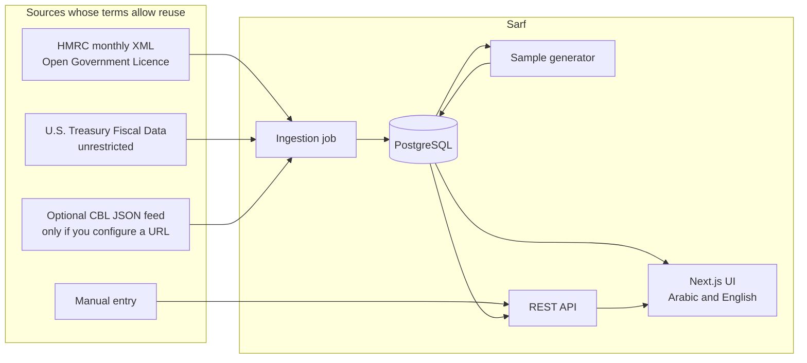

# Sarf

A bilingual desk for the **Libyan dinar**. Sarf shows LYD against USD, EUR, GBP, TRY, EGP, and TND, and charts an official reference series against a parallel series. The parallel series in the demo is a **sample**, labeled as such on the page, in the API, and in the database.

Built by Maeen Alganimi in Tripoli.

## Live demo

Live demo: _not deployed yet_.

## Screenshots

English, desktop:



Arabic, right to left:



A narrow layout keeps the same figures readable: `docs/screenshots/en-mobile.png`.

## Features

- Latest dinar rates for six currencies, quoted as **LYD per 1 unit** of foreign currency.
- Historical chart and table comparing an official reference with a parallel series, including the gap in dinars and the premium in percent.
- Switch the official source between HMRC (monthly) and the U.S. Treasury (quarterly), and the parallel source between the sample and manual entries.
- Public REST API with an [OpenAPI 3.1 document](src/lib/api/openapi.ts) at `/api/openapi.json`, plus a readable reference at `/en/docs`.
- Arabic and English UI, with `dir` and `lang` set for the page and a language toggle that keeps the current query.
- Pluggable ingestion: HMRC XML, Treasury Fiscal Data, an optional operator-supplied CBL JSON feed, and manual entry. Nothing is scraped from sites that do not grant reuse.
- Demo mode runs with **no API keys**. Seed data is committed. Live fetching stays off until `INGEST_LIVE=true`.
- Scheduled job for Vercel Cron at `/api/cron/ingest`.

## Architecture



The sample generator reads stored HMRC rows and writes a parallel series with `provider = sample` and `isSample = true`. It never overwrites manual rows.

| Path | Role |
| --- | --- |
| `src/lib/providers` | Parsers and the source catalogue |
| `src/lib/rates` | Decimal arithmetic, spreads, sample premium, series selection |
| `src/lib/ingestion/run.ts` | Scheduled job. Skips the network when live ingestion is off |
| `src/lib/store` | `RateStore` interface, in-memory store for tests, Prisma store for Postgres |
| `src/app/api` | Route handlers. They delegate to testable functions |
| `src/app/[locale]` | Rates, method, API reference, and manual entry |
| `data/seed` | Committed HMRC and Treasury observations retrieved on 9 October 2026 |
| `prisma` | Schema, SQL migration, seed |

Quotes are stored as decimal strings. Spread and cross-rate math uses `decimal.js`, not binary floating point. The chart converts those strings to numbers only to draw lines.

## API

Base path: `/api/v1`. Quotes use `lyd_per_1_unit`: how many dinars equal one unit of the other currency. Read endpoints send `Access-Control-Allow-Origin: *`.

| Method | Path | Purpose |
| --- | --- | --- |
| `GET` | `/api/v1/health` | Process and database health |
| `GET` | `/api/v1/currencies` | The six currencies, in English and Arabic |
| `GET` | `/api/v1/sources` | Providers, licences, and what this API refuses to scrape |
| `GET` | `/api/v1/rates/latest` | Newest stored row per currency and kind |
| `GET` | `/api/v1/rates/history` | One currency over time |
| `GET` | `/api/v1/rates/compare` | Official and parallel series, with the premium |
| `GET` | `/api/openapi.json` | OpenAPI 3.1 |
| `POST` | `/api/admin/rates` | Manual row. Bearer token |
| `GET` | `/api/cron/ingest` | Ingestion job |

`GET /api/v1/rates/latest?currency=USD` returns both kinds. When several providers share a date, official preference is manual, then `cbl-feed`, then HMRC, then Treasury. Parallel preference is manual, then sample. A newer date from a lower-preference provider still wins, and the response names that provider.

`GET /api/v1/rates/compare?currency=USD&officialProvider=hmrc&parallelProvider=sample` aligns the two series. `parallelProvider=sample` sets `sampleParallel: true`. Every sample point has `parallelSample: true`.

Manual entry:

```bash
curl -X POST http://localhost:3000/api/admin/rates \
  -H "authorization: Bearer demo-admin" \
  -H "content-type: application/json" \
  -d '{"currency":"USD","date":"2026-10-08","kind":"official","lydPerUnit":"6.4287","note":"CBL mid, read from the bank page"}'
```

In demo mode the token defaults to `demo-admin`. Set `DEMO_MODE=false` and a private `ADMIN_TOKEN` before a public deployment that should not accept that token.

## Data sources and their terms

Sarf only ingests sources whose published terms allow this use. The Central Bank of Libya fixing is the domestic official rate, and this app does **not** scrape it.

### Used

**HM Revenue & Customs monthly exchange rates**, via the UK Trade Tariff XML files, for example [October 2026](https://www.trade-tariff.service.gov.uk/api/v2/exchange_rates/files/monthly_xml_2026-10.xml). Covered by the [Open Government Licence v3.0](https://www.nationalarchives.gov.uk/doc/open-government-licence/version/3/), which allows copying, adaptation, and commercial use with attribution.

HMRC publishes foreign-currency units per 1 pound sterling. The sterling/dinar figure is stored as published. The other five currencies are crossed inside Sarf from the same monthly file:

`LYD per 1 unit = (LYD per GBP) / (units of that currency per GBP)`

Those rows are flagged `isDerived: true`. This is the default official line. Attribution, also shown in the footer: *Contains public sector information licensed under the Open Government Licence v3.0.*

**U.S. Department of the Treasury, Bureau of the Fiscal Service**, [Treasury Reporting Rates of Exchange](https://api.fiscaldata.treasury.gov/services/api/fiscal_service/v1/accounting/od/rates_of_exchange). The [API licence](https://fiscaldata.treasury.gov/api-documentation/) offers the data free, without restriction, to copy, adapt, and redistribute for commercial or non-commercial use. `Libya-Dinar` is already dinars per dollar. The other currencies are crossed from the same quarter and flagged as derived. This series is quarterly, so it will not match HMRC on a given day.

**Manual entry and an optional `CBL_FEED_URL`.** Both exist so an operator can record a Central Bank of Libya fixing, or a parallel quote, from a source they are allowed to keep. The feed must be a JSON array of `{ "date", "currency", "lydPerUnit", "note"? }`. There is no default URL.

**Sample parallel series.** Generated by `src/lib/rates/sample.ts`. A repeating monthly premium is applied to the HMRC rate and rounded half up to 4 decimal places. January is +11%, then 12.5, 14, 15.5, 17, 19, 21, 23, 20, 18, 15, and December is +13%. The pattern depends only on the calendar month. It is synthetic. It is not a street rate and must not be used for settlement.

### Not used, and why

**Central Bank of Libya rate page** ([cbl.gov.ly](https://cbl.gov.ly/en/currency-exchange-rates/)). This is where the domestic fixing is published, including buy, sell, and average. The bank's [developer portal](https://central-bank-of-libya.gitbook.io/devportal) documents payment systems for licensed institutions, not a public exchange-rate API. No reuse licence is published for the rate table. A [Frankfurter coverage audit](https://github.com/lineofflight/frankfurter/discussions/291) marks Libya as restricted. `robots.txt` does not disallow the page, and that is not permission to copy it. Sarf does not fetch it.

**Frankfurter** ([licence](https://frankfurter.dev/license/)). The API itself is free and needs no key, and its software is MIT. Blended rates are Frankfurter's own calculation, not an official fixing. Provider terms still apply. The Central Bank of Kuwait, which publishes LYD, [limits reuse to personal use](https://www.cbk.gov.kw/en/footer/disclaimer) and requires written permission for public or commercial use, so that provider is excluded. Frankfurter is not called at runtime.

**IMF statistics** ([copyright and usage](https://www.imf.org/en/about/copyright-and-terms)). Published statistical data, including exchange rates, may be reused with attribution, and material transformations must be disclosed. The current IMF API expects an account, and the Frankfurter IMF provider did not return LYD when this was checked on 9 October 2026, so IMF data is not in the pipeline.

**European Commission InforEuro.** Commission content is generally under [CC BY 4.0](https://commission.europa.eu/legal-notice_en). It was left out to avoid a third monthly series that duplicates HMRC.

**exchange-api** ([fawazahmed0/exchange-api](https://github.com/fawazahmed0/exchange-api/), CC0). The dataset may be used for any purpose and it does include LYD, but it is an aggregated feed rather than a primary official publication, and it is not a parallel-market quote. It is not stored.

**BIS statistics** ([terms](https://data.bis.org/help/legal)). Reuse is allowed with citation, including in a free product. The series is monthly and was not needed once HMRC covered the same idea under a clearer open licence.

## Run locally

Requirements: Node.js 22 and PostgreSQL 16. No FX API key.

```bash
docker compose up -d
cp .env.example .env
npm install
npm run setup
npm run dev
```

`npm run setup` applies the SQL migration and loads the committed seed, then regenerates the sample parallel series. Open [http://localhost:3000](http://localhost:3000). English and Arabic are `/en` and `/ar`.

Demo defaults in `.env.example`:

| Variable | Demo value | Meaning |
| --- | --- | --- |
| `DATABASE_URL` | local Postgres | Only required secret-like setting, and the local password is `sarf` |
| `DEMO_MODE` | `true` | Admin token falls back to `demo-admin` |
| `INGEST_LIVE` | `false` | The job does not call HMRC or Treasury |
| `ADMIN_TOKEN` | empty | Optional override of the demo token |
| `CRON_SECRET` | empty | Required once demo mode is off |
| `CBL_FEED_URL` | empty | Optional JSON feed you are allowed to copy |

To refresh from the upstream files after you accept their terms in production:

```bash
INGEST_LIVE=true npm run ingest
```

The ingestion command reads `.env` from the working directory.

## Deploy

The app is a Next.js project aimed at Vercel, with Postgres on Neon or any other hosted Postgres.

1. Create a Postgres database and copy its pooled connection string into `DATABASE_URL`.
2. Set `DEMO_MODE=false`, a long `ADMIN_TOKEN`, and a long `CRON_SECRET`. Leave `INGEST_LIVE=true` if the deployment should refresh HMRC and Treasury.
3. Override the Vercel build command so migrations and the seed run where the database is reachable:

```bash
npx prisma migrate deploy && npx tsx prisma/seed.ts && npx next build
```

The default `npm run build` does not migrate. GitHub Actions has no database, and the test suite uses an in-memory store.

4. `vercel.json` schedules `GET /api/cron/ingest` at 06:15 UTC. Vercel sends `Authorization: Bearer $CRON_SECRET` when that variable is set.

The seed is idempotent. Running it on each deploy refreshes HMRC, Treasury, and the sample. It does not delete manual rows.

## Tests and CI

```bash
npm test
npm run lint
npm run typecheck
npm run build
```

Tests cover HMRC XML parsing, Treasury crossing, decimal spreads, the sample premium, ingestion with the network disabled, idempotent upserts, and the latest, history, compare, admin, and cron handlers. GitHub Actions runs lint, typecheck, test, and build on pushes to `main` and on pull requests.

## Licence

MIT. See [LICENSE](LICENSE).

The MIT licence covers this repository's code. It does not replace the licences of the rate data, which stay with their publishers and are named above. Sample rows are synthetic and are not a licence to treat them as market data.
